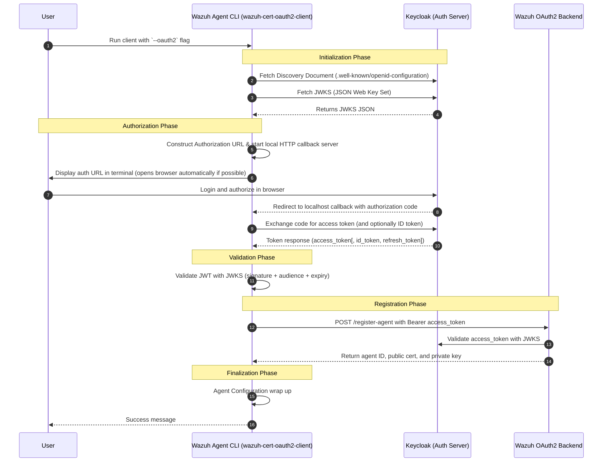
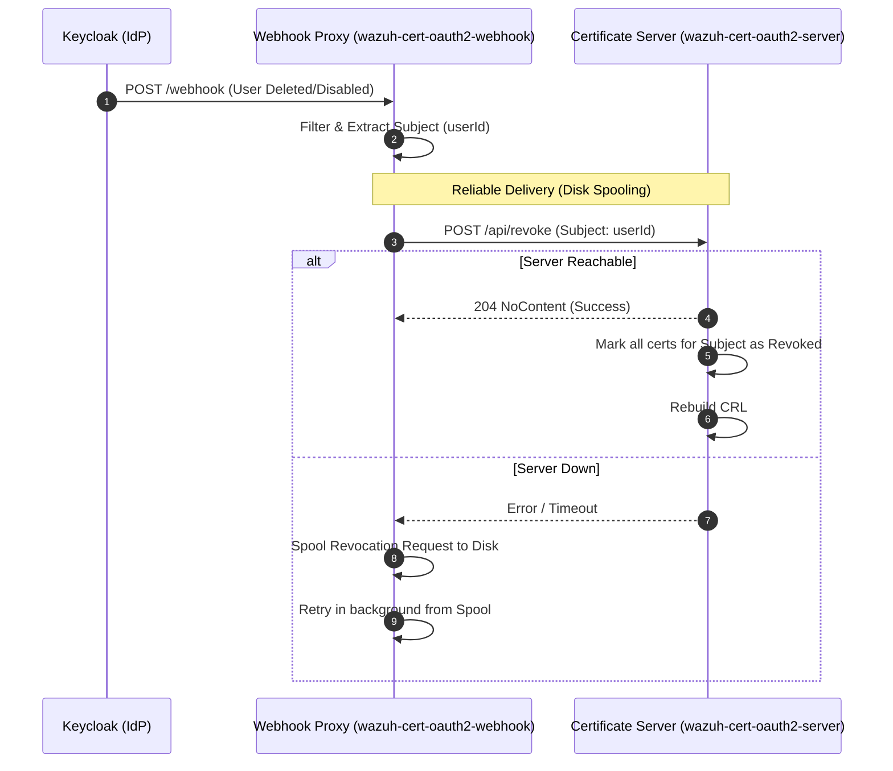
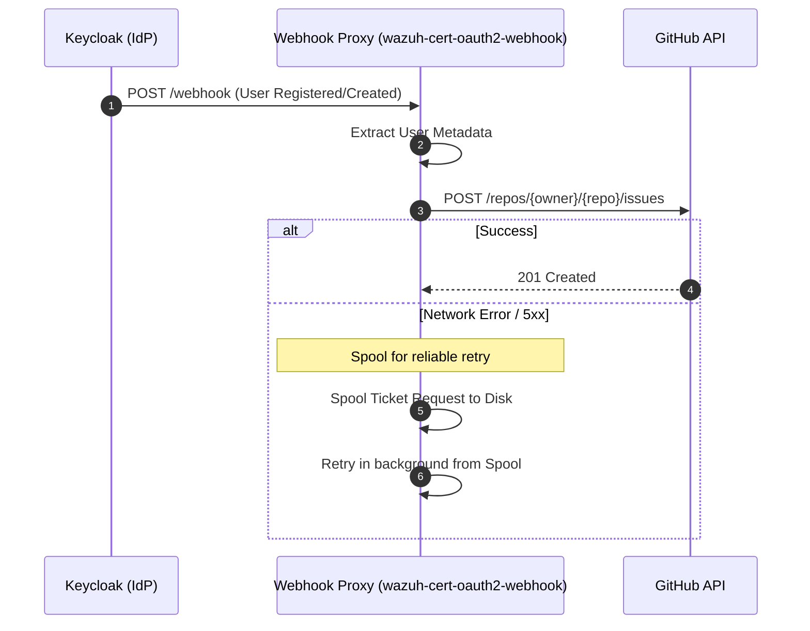
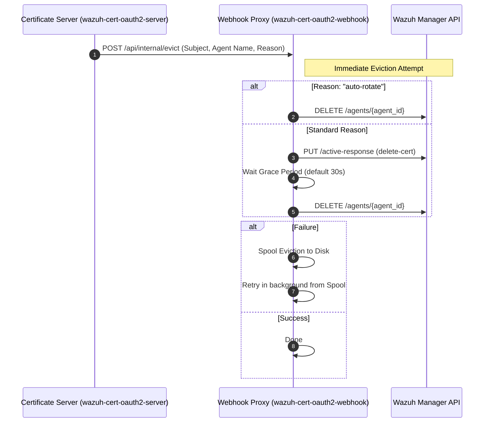

# Project Architecture

This document describes the high-level architecture of the `wazuh-cert-oauth2` project and how its components interact.

## Components Overview

1.  **Wazuh Agent CLI (`wazuh-cert-oauth2-client`)**: A CLI tool run on the Wazuh agent host. It handles user authentication via OIDC, CSR generation, and submission to the backend.
2.  **Certificate Server (`wazuh-cert-oauth2-server`)**: The central backend that validates OIDC tokens, signs CSRs using a Root CA, and manages the Certificate Revocation List (CRL).
3.  **Webhook Proxy (`wazuh-cert-oauth2-webhook`)**: A specialized service that listens for events from the Identity Provider (e.g., Keycloak). It features persistent disk-backed spooling for reliable delivery of revocations, GitHub issue creation, and Wazuh agent evictions.
4.  **Keycloak (IdP)**: The Identity Provider responsible for user authentication and triggering webhook events when user states change.

---

## Communication Flows

### 1. Agent Enrollment (Client-Server Flow)

The following diagram illustrates the process of an agent obtaining a signed certificate via the OAuth2 flow.

### 2. Automated Revocation (Webhook Flow)

The Webhook Proxy automates certificate revocation when a user's account is disabled or deleted in Keycloak.

### 3. User Registration Tracking (GitHub Issue Flow)

When a new user registers or is created in Keycloak, the Webhook Proxy handles the event and creates an issue in GitHub for administrative tracking.

### 4. Internal Eviction Flow (Server-to-Webhook)

When the Certificate Server detects a re-enrollment that overrides an active certificate, it notifies the Webhook Proxy to perform an agent eviction in Wazuh.

#### Webhook Details:
- **Resiliency**: The Webhook Proxy includes a persistent spooling mechanism and automatic retries with exponential backoff for all upstream requests (Certificate Server and GitHub API).
- **Filtering**: The proxy identifies revoke-eligible events (`USER-DELETE`/`USER-UPDATE`) and ticket-eligible events (`REGISTER`/`USER-CREATE`).
- **GitHub Integration**: For registration events, the proxy automatically creates a tracking issue in the configured GitHub repository.

---

## Component Responsibilities

| Component | Responsibility |
| :--- | :--- |
| **Client** | CSR Generation, OIDC Auth, Local Config Management |
| **Server** | Token Validation, CSR Signing (CA), CRL Generation, Ledger Persistence |
| **Webhook** | Event Transformation, Persistent Spooling, Wazuh Agent Eviction |
| **Model** | Shared Data Structures & Centralized Wazuh API Client |
