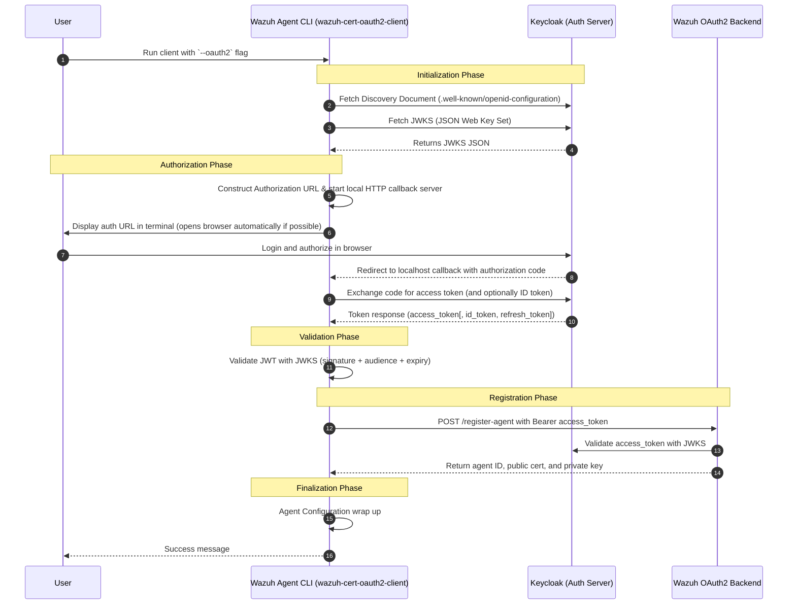
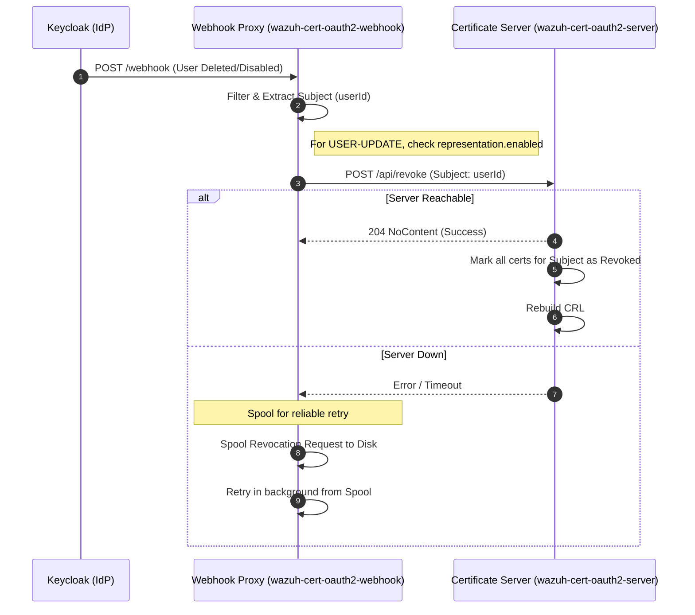
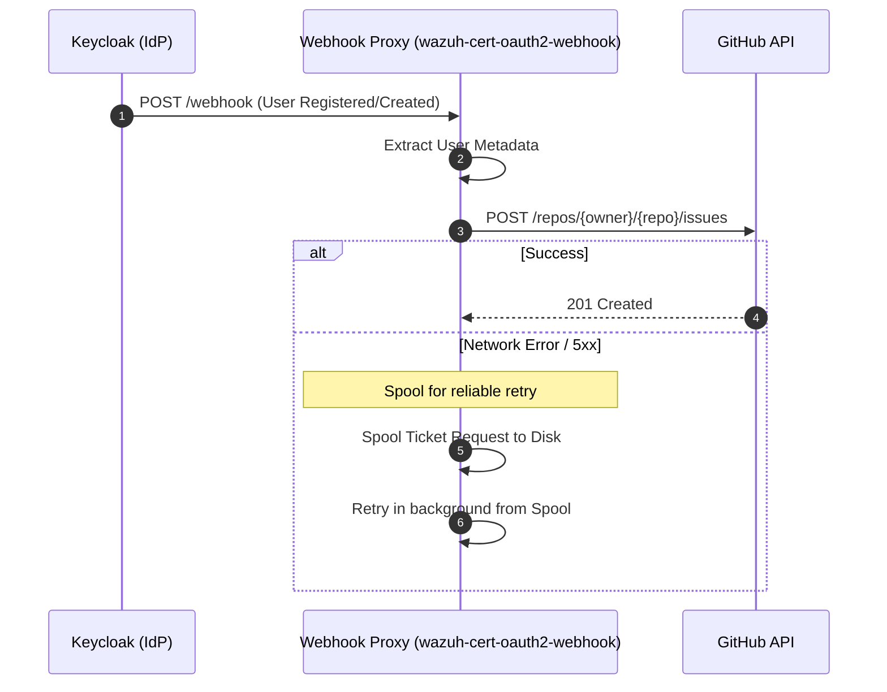
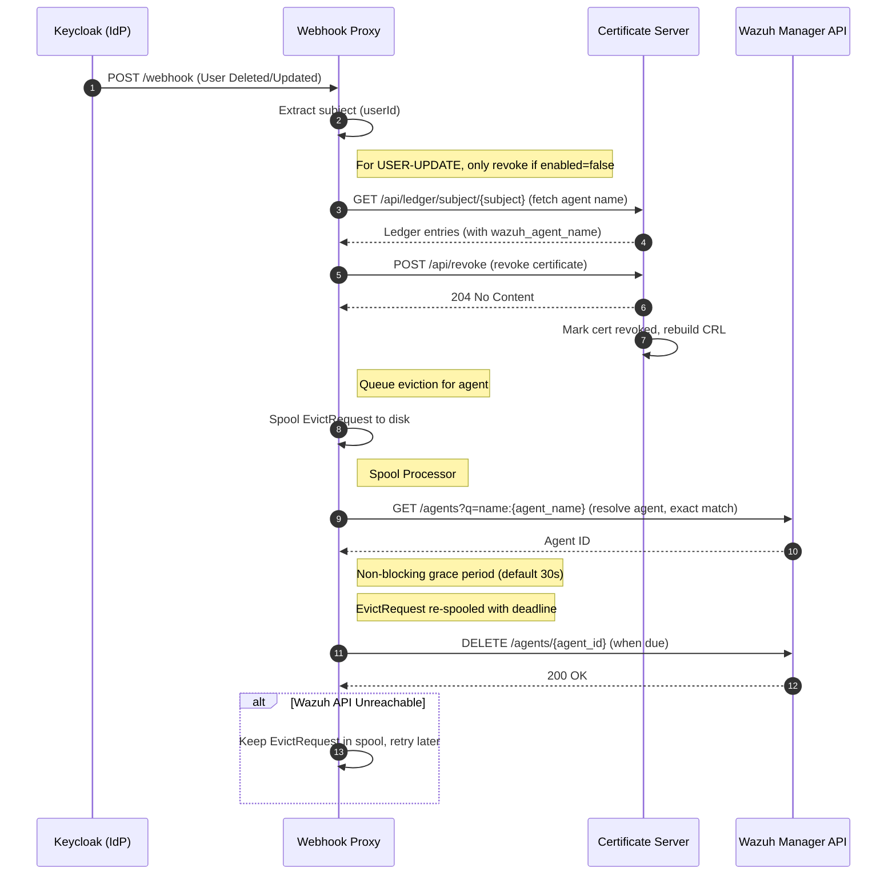
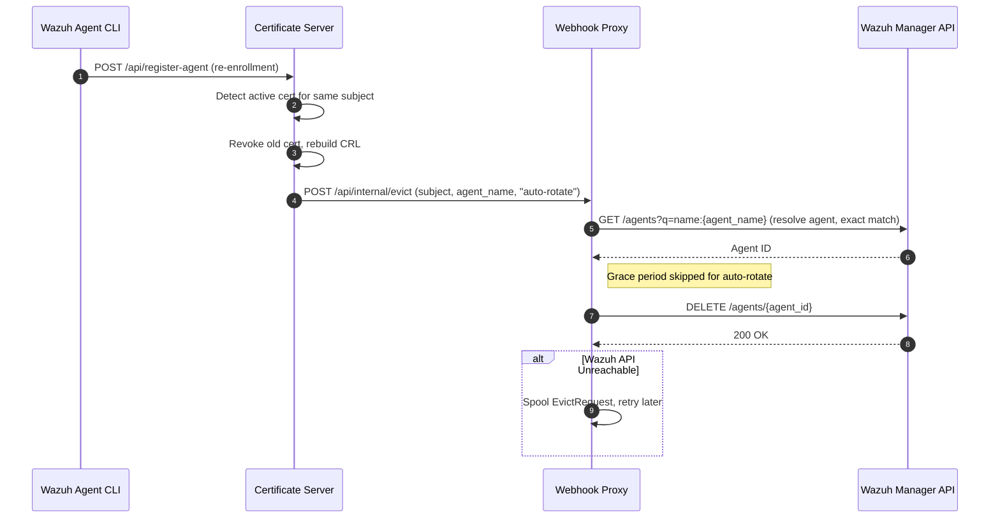

# Project Architecture

This document describes the high-level architecture of the `wazuh-cert-oauth2` project and how its components interact.

## Components Overview

1.  **Wazuh Agent CLI (`wazuh-cert-oauth2-client`)**: A CLI tool run on the Wazuh agent host. It handles user authentication via OIDC, CSR generation, and submission to the backend.
2.  **Certificate Server (`wazuh-cert-oauth2-server`)**: The central backend that validates OIDC tokens, signs CSRs using a Root CA, and manages the Certificate Revocation List (CRL).
3.  **Webhook Proxy (`wazuh-cert-oauth2-webhook`)**: A specialized service that listens for events from the Identity Provider (e.g., Keycloak). It features persistent disk-backed spooling for reliable delivery of revocations, GitHub issue creation, and Wazuh agent evictions via the Wazuh Manager REST API.
4.  **Keycloak (IdP)**: The Identity Provider responsible for user authentication and triggering webhook events when user states change.

---

## Communication Flows

### 1. Agent Enrollment (Client-Server Flow)

The following diagram illustrates the process of an agent obtaining a signed certificate via the OAuth2 flow.

### 2. Automated Revocation (Webhook Flow)

The Webhook Proxy automates certificate revocation when a user's account is disabled or deleted in Keycloak.

### 3. User Registration Tracking (GitHub Issue Flow)

When a new user registers or is created in Keycloak, the Webhook Proxy handles the event and creates an issue in GitHub for administrative tracking.

### 4. Agent Eviction Flow

When a certificate is revoked, the corresponding Wazuh agent must be removed from the manager. The eviction pipeline resolves the agent by name via the Wazuh Manager REST API and deletes it directly.

#### 4a. Keycloak-Triggered Eviction (User Delete/Update)

When Keycloak fires a user-delete or user-update event, the webhook revokes the certificate and then queues an eviction request.

#### 4b. Auto-Rotate Eviction (Server-Triggered)

When the Certificate Server detects a re-enrollment that overrides an active certificate, it notifies the Webhook Proxy to evict the old agent immediately — no grace period.

#### Eviction Details:
- **Direct API**: The eviction pipeline resolves agents by name via `GET /agents?q=name=` (exact match) and deletes them via `DELETE /agents/{id}` using the Wazuh Manager REST API.
- **Non-blocking Grace Period**: For Keycloak-triggered revocations, the spool processor sets a grace deadline (`delete_after_unix`) and re-writes the `EvictRequest` to disk instead of blocking. The item is skipped on subsequent scans until the deadline elapses, allowing other spool items to be processed concurrently. The grace period defaults to `WAZUH_EVICTION_GRACE_SECONDS` (30s) and is skipped entirely for auto-rotate evictions.
- **Resiliency**: If the Wazuh API is unreachable, the `EvictRequest` is persisted to the spool directory and retried in the background with exponential backoff. Spool file rewrites are atomic (temp-file + rename) to prevent corruption on crash.
- **TTL Dead-Letter**: Eviction spool items older than 24 hours are force-deleted with an `error!` log, preventing unbounded retry of poison messages.
- **Double-Failure Safety**: If both the direct eviction call and the spool queue fail, the `/api/internal/evict` endpoint returns `500 Internal Server Error` so the caller (cert-server) knows the request was lost and can retry.
- **Filtering**: The proxy identifies revoke-eligible events and ticket-eligible events. For `USER-DELETE`, revocation is always triggered. For `USER-UPDATE`, the webhook representation is parsed and revocation is only triggered when `enabled: false` (user being disabled). When `enabled: true` (user being re-enabled), the event is ignored. If the representation is missing or unparseable, the proxy fails safe to revocation.
- **GitHub Integration**: For registration events, the proxy automatically creates a tracking issue in the configured GitHub repository.

---

## Component Responsibilities

| Component | Responsibility |
| :--- | :--- |
| **Client** | CSR Generation, OIDC Auth, Local Config Management |
| **Server** | Token Validation, CSR Signing (CA), CRL Generation, Ledger Persistence |
| **Webhook** | Event Transformation, Persistent Spooling, Wazuh Agent Eviction (via REST API) |
| **Model** | Shared Data Structures & Centralized Wazuh API Client |
