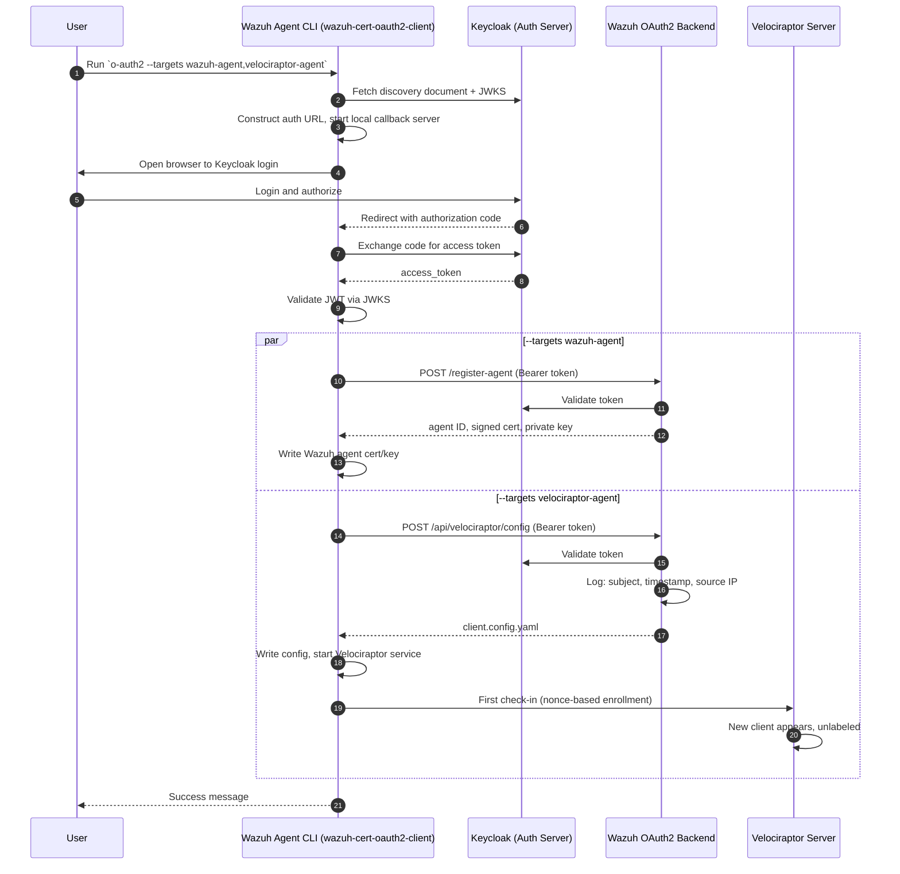
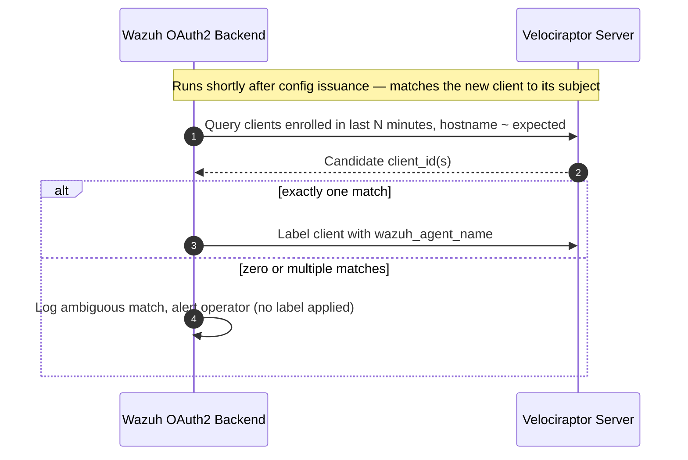
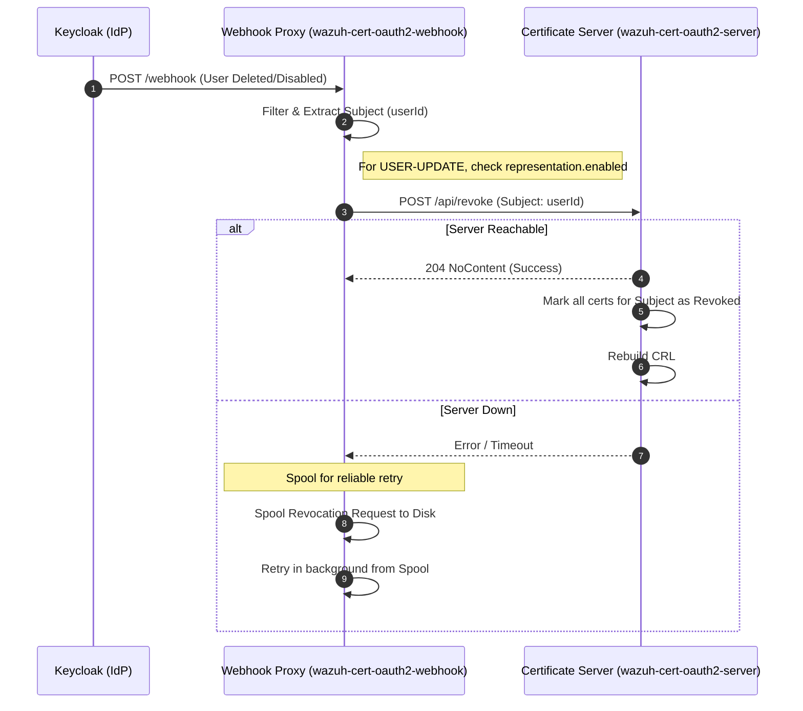
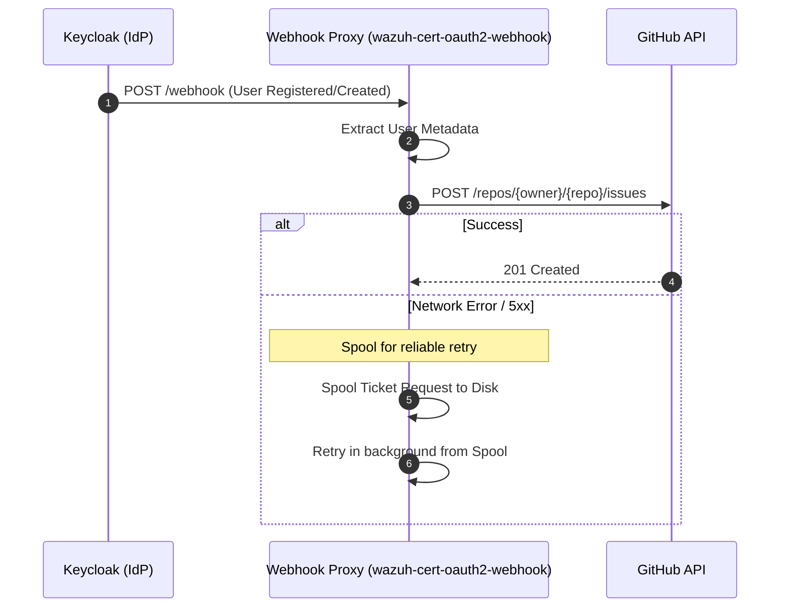
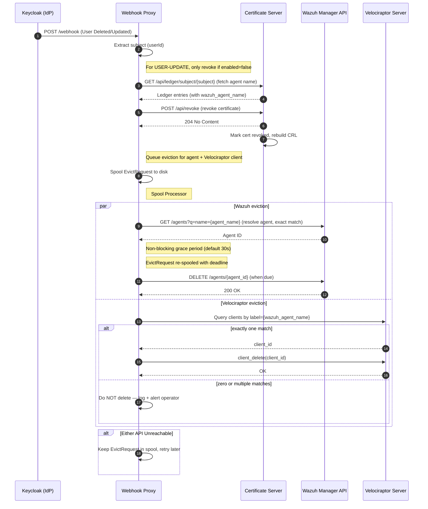
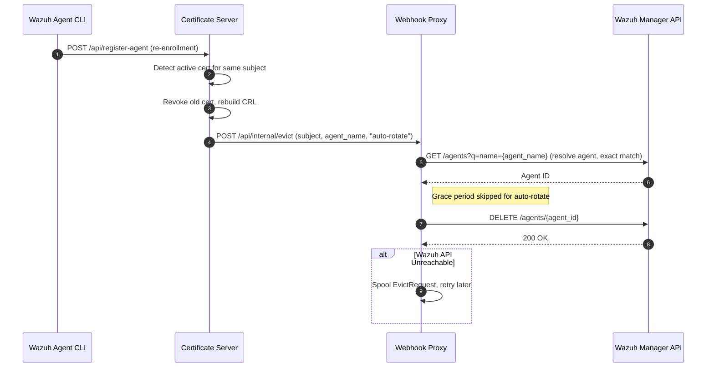

# Project Architecture

This document describes the high-level architecture of the `wazuh-cert-oauth2` project and how its components interact.

## Components Overview

1.  **Wazuh Agent CLI (`wazuh-cert-oauth2-client`)**: A CLI tool run on the Wazuh agent host. It handles user authentication via OIDC, CSR generation, and submission to the backend. It can also fetch a Velociraptor client configuration in the same authenticated session.
2.  **Certificate Server (`wazuh-cert-oauth2-server`)**: The central backend that validates OIDC tokens, signs CSRs using a Root CA, manages the Certificate Revocation List (CRL), and gates distribution of the Velociraptor client configuration.
3.  **Webhook Proxy (`wazuh-cert-oauth2-webhook`)**: A specialized service that listens for events from the Identity Provider (e.g., Keycloak). It features persistent disk-backed spooling for reliable delivery of revocations, GitHub issue creation, and Wazuh agent/Velociraptor client evictions.
4.  **Keycloak (IdP)**: The Identity Provider responsible for user authentication and triggering webhook events when user states change.
5.  **Velociraptor Server**: Endpoint telemetry/DFIR platform. Clients enroll using a shared nonce embedded in `client.config.yaml`; the Certificate Server gates who can obtain that file. Enrolled clients are labeled post-enrollment so they can be targeted for eviction.

---

## Communication Flows

### 1. Enrollment (Client-Server Flow)

The following diagram illustrates the process of an agent obtaining a signed certificate via the OAuth2 flow. The CLI authenticates a user and exchanges the authentication for credentials/config from the backend. `--targets` selects which credentials/config to request in a given run; either or both can be requested in a single OIDC login.

```mermaid
sequenceDiagram
    autonumber

    participant User as User
    participant AgentClient as Wazuh Agent CLI (wazuh-cert-oauth2-client)
    participant Keycloak as Keycloak (Auth Server)
    participant WazuhAPI as Wazuh OAuth2 Backend
    participant VeloServer as Velociraptor Server

    User->>AgentClient: Run `o-auth2 --targets wazuh-agent,velociraptor-agent`
    AgentClient->>Keycloak: Fetch discovery document + JWKS
    AgentClient->>AgentClient: Construct auth URL, start local callback server
    AgentClient->>User: Open browser to Keycloak login
    User->>Keycloak: Login and authorize
    Keycloak-->>AgentClient: Redirect with authorization code
    AgentClient->>Keycloak: Exchange code for access token
    Keycloak-->>AgentClient: access_token
    AgentClient->>AgentClient: Validate JWT via JWKS

    par --targets wazuh-agent
        AgentClient->>WazuhAPI: POST /register-agent (Bearer token)
        WazuhAPI->>Keycloak: Validate token
        WazuhAPI-->>AgentClient: agent ID, signed cert, private key
        AgentClient->>AgentClient: Write Wazuh agent cert/key
    and --targets velociraptor-agent
        AgentClient->>WazuhAPI: POST /api/velociraptor/config (Bearer token)
        WazuhAPI->>Keycloak: Validate token
        WazuhAPI->>WazuhAPI: Log: subject, timestamp, source IP
        WazuhAPI-->>AgentClient: client.config.yaml
        AgentClient->>AgentClient: Write config, start Velociraptor service
        AgentClient->>VeloServer: First check-in (nonce-based enrollment)
        VeloServer->>VeloServer: New client appears, unlabeled
    end

    AgentClient-->>User: Success message
```

**Notes:**
- `--targets` accepts `wazuh-agent`, `velociraptor-agent`, or both.
- The OIDC discovery/JWKS/token-exchange code path is shared and unchanged regardless of which targets are requested: only the post-auth dispatch differs.
- The Velociraptor config is served from a file mounted read-only on the Certificate Server (e.g. a Vault/K8s secret).

### 2. Velociraptor Client Labeling (Async, Best-Effort)

Velociraptor's enrollment nonce is a shared secret with no per-client scoping, so the Certificate Server cannot bind an enrolled Velociraptor client to a subject at enrollment time the way it can for Wazuh (via signed cert). Instead, shortly after config issuance, the server attempts to match and label the newly-appeared client using a short time window, since hostnames and IPs can drift and are not used as the long-term key.

```mermaid
sequenceDiagram
    autonumber

    participant WazuhAPI as Wazuh OAuth2 Backend
    participant VeloServer as Velociraptor Server

    Note over WazuhAPI,VeloServer: Runs shortly after config issuance — matches the new client to its subject

    WazuhAPI->>VeloServer: Query clients enrolled in last N minutes, hostname ~ expected
    VeloServer-->>WazuhAPI: Candidate client_id(s)

    alt exactly one match
        WazuhAPI->>VeloServer: Label client with wazuh_agent_name
    else zero or multiple matches
        WazuhAPI->>WazuhAPI: Log ambiguous match, alert operator (no label applied)
    end
```

### 3. Automated Revocation (Webhook Flow)

The Webhook Proxy automates certificate revocation when a user's account is disabled or deleted in Keycloak.

```mermaid
sequenceDiagram
    autonumber

    participant Keycloak as Keycloak (IdP)
    participant Webhook as Webhook Proxy (wazuh-cert-oauth2-webhook)
    participant Server as Certificate Server (wazuh-cert-oauth2-server)

    Keycloak->>Webhook: POST /webhook (User Deleted/Disabled)
    Webhook->>Webhook: Filter & Extract Subject (userId)
    Note right of Webhook: For USER-UPDATE, check representation.enabled

    Webhook->>Server: POST /api/revoke (Subject: userId)

    alt Server Reachable
        Server-->>Webhook: 204 NoContent (Success)
        Server->>Server: Mark all certs for Subject as Revoked
        Server->>Server: Rebuild CRL
    else Server Down
        Server-->>Webhook: Error / Timeout
        Note over Webhook: Spool for reliable retry
        Webhook->>Webhook: Spool Revocation Request to Disk
        Webhook->>Webhook: Retry in background from Spool
    end
```

### 4. User Registration Tracking (GitHub Issue Flow)

When a new user registers or is created in Keycloak, the Webhook Proxy handles the event and creates an issue in GitHub for administrative tracking.

```mermaid
sequenceDiagram
    autonumber

    participant Keycloak as Keycloak (IdP)
    participant Webhook as Webhook Proxy (wazuh-cert-oauth2-webhook)
    participant GitHub as GitHub API

    Keycloak->>Webhook: POST /webhook (User Registered/Created)
    Webhook->>Webhook: Extract User Metadata

    Webhook->>GitHub: POST /repos/{owner}/{repo}/issues

    alt Success
        GitHub-->>Webhook: 201 Created
    else Network Error / 5xx
        Note over Webhook: Spool for reliable retry
        Webhook->>Webhook: Spool Ticket Request to Disk
        Webhook->>Webhook: Retry in background from Spool
    end
```

### 5. Agent & Client Eviction Flow

When a certificate is revoked, the corresponding Wazuh agent and Velociraptor client must be removed. The eviction pipeline resolves the Wazuh agent by name via the Wazuh Manager REST API, and resolves the Velociraptor client by label (assigned during the labeling flow above).

#### 5a. Keycloak-Triggered Eviction (User Delete/Update)

When Keycloak fires a user-delete or user-update event, the webhook revokes the certificate and then queues eviction requests for both Wazuh and Velociraptor.

```mermaid
sequenceDiagram
    autonumber

    participant Keycloak as Keycloak (IdP)
    participant Webhook as Webhook Proxy
    participant Server as Certificate Server
    participant Wazuh as Wazuh Manager API
    participant Velo as Velociraptor Server

    Keycloak->>Webhook: POST /webhook (User Deleted/Updated)
    Webhook->>Webhook: Extract subject (userId)
    Note right of Webhook: For USER-UPDATE, only revoke if enabled=false
    Webhook->>Server: GET /api/ledger/subject/{subject} (fetch agent name)
    Server-->>Webhook: Ledger entries (with wazuh_agent_name)
    Webhook->>Server: POST /api/revoke (revoke certificate)
    Server-->>Webhook: 204 No Content
    Server->>Server: Mark cert revoked, rebuild CRL

    Note right of Webhook: Queue eviction for agent + Velociraptor client
    Webhook->>Webhook: Spool EvictRequest to disk

    Note right of Webhook: Spool Processor
    par Wazuh eviction
        Webhook->>Wazuh: GET /agents?q=name={agent_name} (resolve agent, exact match)
        Wazuh-->>Webhook: Agent ID
        Note right of Webhook: Non-blocking grace period (default 30s)
        Note right of Webhook: EvictRequest re-spooled with deadline
        Webhook->>Wazuh: DELETE /agents/{agent_id} (when due)
        Wazuh-->>Webhook: 200 OK
    and Velociraptor eviction
        Webhook->>Velo: Query clients by label={wazuh_agent_name}
        alt exactly one match
            Velo-->>Webhook: client_id
            Webhook->>Velo: client_delete(client_id)
            Velo-->>Webhook: OK
        else zero or multiple matches
            Webhook->>Webhook: Do NOT delete — log + alert operator
        end
    end

    alt Either API Unreachable
        Webhook->>Webhook: Keep EvictRequest in spool, retry later
    end
```

#### 5b. Auto-Rotate Eviction (Server-Triggered)

When the Certificate Server detects a re-enrollment that overrides an active certificate, it notifies the Webhook Proxy to evict the old agent immediately — no grace period. This currently applies to the Wazuh agent; Velociraptor re-labeling on re-enrollment is handled by the async labeling flow (Flow 2) rather than an immediate evict, since a stale label simply fails to match on the next lookup rather than posing an active risk.

```mermaid
sequenceDiagram
    autonumber

    participant Agent as Wazuh Agent CLI
    participant Server as Certificate Server
    participant Webhook as Webhook Proxy
    participant Wazuh as Wazuh Manager API

    Agent->>Server: POST /api/register-agent (re-enrollment)
    Server->>Server: Detect active cert for same subject
    Server->>Server: Revoke old cert, rebuild CRL
    Server->>Webhook: POST /api/internal/evict (subject, agent_name, "auto-rotate")

    Webhook->>Wazuh: GET /agents?q=name={agent_name} (resolve agent, exact match)
    Wazuh-->>Webhook: Agent ID
    Note right of Webhook: Grace period skipped for auto-rotate
    Webhook->>Wazuh: DELETE /agents/{agent_id}
    Wazuh-->>Webhook: 200 OK

    alt Wazuh API Unreachable
        Webhook->>Webhook: Spool EvictRequest, retry later
    end
```

#### Eviction Details:
- **Direct API**: The eviction pipeline resolves Wazuh agents by name via `GET /agents?q=name=` (exact match) and deletes them via `DELETE /agents/{id}` using the Wazuh Manager REST API. Velociraptor clients are resolved by label (assigned during Flow 2) and removed via `client_delete`.
- **Non-blocking Grace Period**: For Keycloak-triggered revocations, the spool processor sets a grace deadline (`delete_after_unix`) and re-writes the `EvictRequest` to disk instead of blocking. The item is skipped on subsequent scans until the deadline elapses, allowing other spool items to be processed concurrently. The grace period defaults to `WAZUH_EVICTION_GRACE_SECONDS` (30s) and is skipped entirely for auto-rotate evictions.
- **Fail-Closed Label Matching**: If the label lookup against the Velociraptor server returns zero or more than one candidate client, the eviction pipeline does not delete anything, it logs the ambiguity and alerts an operator. A missed automatic eviction is preferable to deleting the wrong client, since `client_delete` is not reversible in the same way CRL-based Wazuh revocation is.
- **Resiliency**: If the Wazuh API or Velociraptor server is unreachable, the `EvictRequest` is persisted to the spool directory and retried in the background with exponential backoff. Spool file rewrites are atomic (temp-file + rename) to prevent corruption on crash.
- **TTL Dead-Letter**: Eviction spool items older than the configured TTL (`SPOOL_EVICT_TTL_SECS`, default 86400s / 24h) are moved to the dead-letter directory (`SPOOL_DEAD_LETTER_DIR`, default `dead-letter/` sibling of `SPOOL_DIR`) with an `error!` log, preventing unbounded retry of poison messages while preserving the item for operator inspection or replay. The dead-letter directory must not be the same as `SPOOL_DIR` and should live on the same filesystem/volume to ensure atomic rename.
- **Double-Failure Safety**: If both the direct eviction call and the spool queue fail, the `/api/internal/evict` endpoint returns `500 Internal Server Error` so the caller (cert-server) knows the request was lost and can retry.
- **Filtering**: The proxy identifies revoke-eligible events and ticket-eligible events. For `USER-DELETE`, revocation is always triggered. For `USER-UPDATE`, the webhook representation is parsed and revocation is only triggered when `enabled: false` (user being disabled). When `enabled: true` (user being re-enabled), the event is ignored. If the representation is missing or unparseable, the proxy fails safe to revocation.
- **GitHub Integration**: For registration events, the proxy automatically creates a tracking issue in the configured GitHub repository.

---

## Component Responsibilities

| Component | Responsibility |
| :--- | :--- |
| **Client** | CSR Generation, OIDC Auth, Local Config Management, Velociraptor Config Fetch |
| **Server** | Token Validation, CSR Signing (CA), CRL Generation, Ledger Persistence, Velociraptor Config Distribution + Access Audit |
| **Webhook** | Event Transformation, Persistent Spooling, Wazuh Agent + Velociraptor Client Eviction (via REST API / label lookup) |
| **Model** | Shared Data Structures & Centralized Wazuh API Client |
| **Velociraptor Server** | Endpoint telemetry collection; client labeling (via async match); eviction target (label-based `client_delete`) |